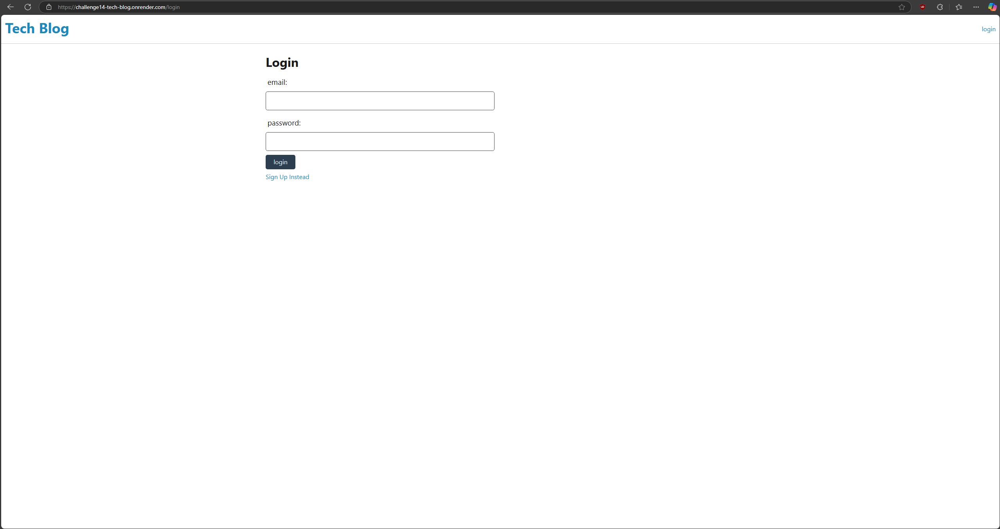
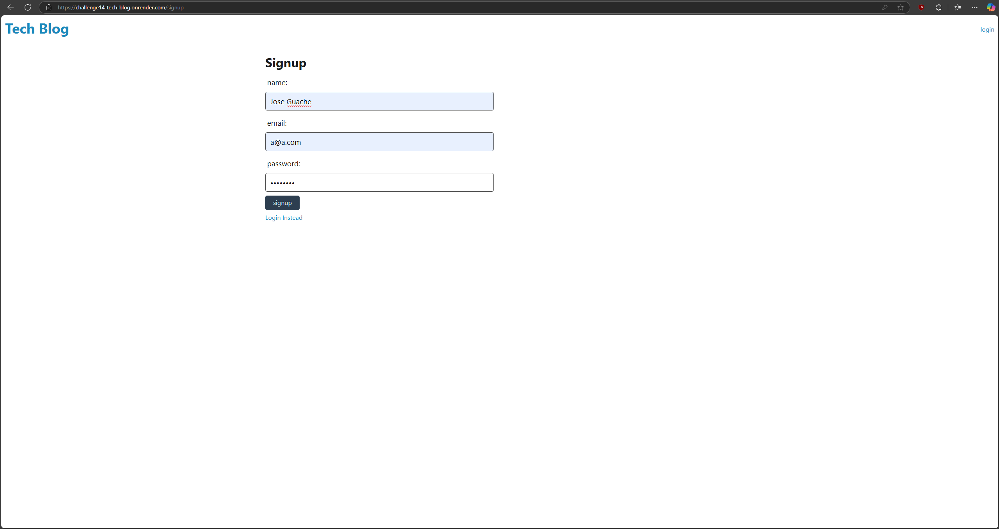
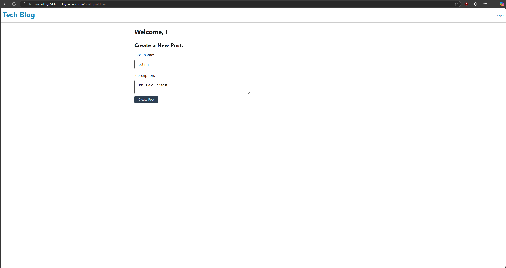
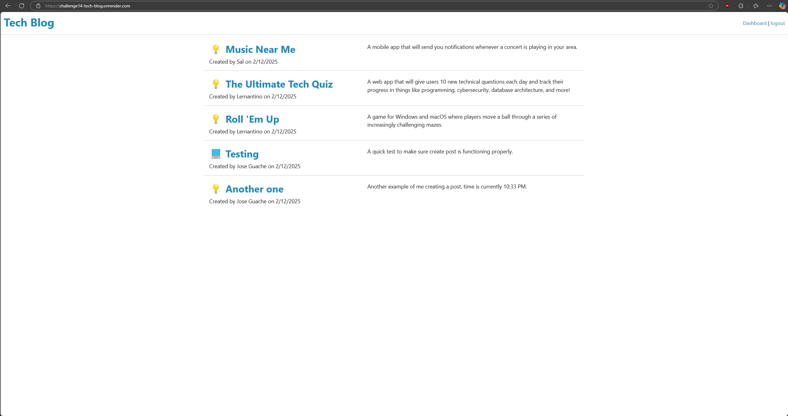

# challenge14-Tech-Blog

## Description

A CMS-style blog site where developers can publish their blog posts and comment on other developers' posts. This application follows the MVC paradigm in its architectural structure, using Handlebars.js as the templating language, Sequelize as the ORM, and the express-session npm package for authentication.

## Features

- User Authentication
  - Sign up for a new account
  - Log in to existing account
  - Log out functionality
- Blog Posts
  - Create new blog posts
  - View all blog posts
  - Edit your own posts
  - Delete your own posts
- Interactive UI
  - Dashboard for managing your posts
  - Homepage displaying all posts
  - Individual post views
- Secure password handling with bcrypt
- Session management for logged-in users

## Installation

1. Clone the repository:
   ```bash
   git clone git@github.com:JoseGuache/challenge14-Tech-Blog.git
   ```
2. Navigate to the project directory
3. Install dependencies:
   ```bash
   npm install
   ```
4. Create a `.env` file and add your PostgreSQL credentials:
   ```
   DB_NAME='techblog_db'
   DB_USER='postgres'
   DB_PASSWORD='your_password'
   ```
5. Set up the database:
   ```bash
   psql -U postgres
   \i schema.sql
   ```

## Usage

1. Start the server:
   ```bash
   npm start
   ```
2. Visit `http://localhost:3001` in your browser
3. Sign up for a new account or log in
4. Create, view, edit, and delete blog posts
5. View other users' posts

## Technologies Used

- Node.js
- Express.js
- PostgreSQL
- Sequelize ORM
- Handlebars.js
- express-session for authentication
- bcrypt for password hashing
- dotenv for environment variables

## Live Demo

[View the deployed application on Render](https://challenge14-tech-blog.onrender.com)

## Screenshots






## Credits

- Starter code provided by Professor Phil.
- [Professional README Guide](https://coding-boot-camp.github.io/full-stack/github/professional-readme-guide)
- [Render Documentation](https://render.com/docs/)

## License

This project is licensed under the MIT License - see the [LICENSE](https://opensource.org/licenses/MIT) for details.

[](https://opensource.org/licenses/MIT)